# train(1).py - Pathway BDH Model Wrapper

A training wrapper for the **BDH (Backstory Distinction Heuristic)** language model from Pathway Technology.

---

## Architecture Overview

```mermaid
flowchart TD
    subgraph Input["� Input"]
        BYTES[Raw Bytes<br/>vocab_size=256]
    end

    subgraph BDH["🧠 BDH Model"]
        EMB[Embedding Layer<br/>256 → 256 dims]
        LN[LayerNorm]
        
        subgraph Layers["6 Transformer Layers"]
            ENC[Encoder Projection<br/>D → N per head]
            RELU1[ReLU Activation]
            ATTN[RoPE Attention<br/>4 heads]
            ENCV[Encoder V Projection]
            RELU2[ReLU Activation]
            MUL[Element-wise Multiply]
            DEC[Decoder Projection<br/>N*heads → D]
        end
        
        HEAD[LM Head<br/>256 → 256 vocab]
    end

    subgraph Output["� Output"]
        LOGITS[Logits]
        LOSS[Cross-Entropy Loss]
    end

    BYTES --> EMB
    EMB --> LN
    LN --> Layers
    Layers --> HEAD
    HEAD --> LOGITS
    HEAD --> LOSS
```



---

## Model Configuration

| Parameter | Value | Description |
|-----------|-------|-------------|
| `n_layer` | 6 | Number of transformer layers |
| `n_embd` | 256 | Embedding dimension |
| `n_head` | 4 | Attention heads |
| `dropout` | 0.1 | Dropout rate |
| `vocab_size` | 256 | Byte-level vocabulary |
| `mlp_internal_dim_multiplier` | 128 | MLP expansion factor |

---

## Training Pipeline

```mermaid
flowchart LR
    subgraph Books["📁 Books Folder"]
        B1[Book1.txt]
        B2[Book2.txt]
        B3[Book3.txt]
    end

    subgraph Training["� Model Training"]
        BDH[bdh.py<br/>BDH Model]
        OPT[AdamW<br/>Optimizer]
    end

    subgraph Output["� Output Models"]
        M1[book1.pt]
        M2[book2.pt]
        M3[book3.pt]
    end

    B1 --> BDH
    B2 --> BDH
    B3 --> BDH
    BDH --> OPT
    OPT --> M1
    OPT --> M2
    OPT --> M3
```



---

## Code Explanation

### Device & Precision Setup

```python
device = torch.device("cuda" if torch.cuda.is_available() else "cpu")
dtype = "bfloat16" if torch.cuda.is_bf16_supported() else "float16"
scaler = torch.amp.GradScaler(enabled=(dtype == "float16"))
```

- **Auto device selection**: GPU if available, otherwise CPU
- **Mixed precision**: Uses BF16/FP16 for faster training
- **GradScaler**: Prevents underflow in FP16 training

---

### `get_batch(input_file_path)`


| Parameter | Type | Description |
|-----------|------|-------------|
| `input_file_path` | str | Path to the novel/book file |

**Returns:** `(x, y)` tensors of shape `(BATCH_SIZE, BLOCK_SIZE)`.

**Process:**
1. Memory-maps file as bytes using `np.memmap`
2. Calculates max starting positions aligned to 256-byte stride
3. Randomly selects `BATCH_SIZE` chunk starting indices
4. Creates input (`x`) and target (`y`, shifted +1) tensor pairs
5. Pins memory for async GPU transfer (if CUDA available)

---

### `train_novel()`

Main training loop for each book in `Books/` directory.

**Workflow:**
1. Iterates over all files in `Books/` directory
2. For each book:
   - Initializes fresh BDH model
   - Creates AdamW optimizer (`lr=1e-3`, `weight_decay=0.1`)
   - Trains for 500 iterations
   - Logs loss every 100 steps
3. Saves model checkpoint as `{book_name}.pt`

---

## Classification Pipeline

```mermaid
flowchart TD
    subgraph Data["📄 Data Loading"]
        CSV[train.csv / test.csv]
        DS[BackstoryDataset]
        TOK[text_to_tokens<br/>UTF-8 encoding]
        CHUNK[chunk_tokens<br/>Sliding Window]
    end

    subgraph Model["🧠 BackstoryClassifier"]
        BDH[BDH Backbone<br/>get_embeddings]
        POOL[Mean Pooling<br/>with mask]
        HEAD[Classification Head<br/>LayerNorm → Linear → GELU → Linear]
    end

    subgraph Training["🔄 Training"]
        WCE[Weighted CrossEntropy<br/>handles class imbalance]
        TRAIN[Train on all samples]
        SCHED[CosineAnnealing LR]
    end

    subgraph Output["📊 Output"]
        PRED[Predictions<br/>consistent / contradict]
        SUB[submission.csv]
    end

    CSV --> DS
    DS --> TOK
    TOK --> CHUNK
    CHUNK --> BDH
    BDH --> POOL
    POOL --> HEAD
    HEAD --> WCE
    WCE --> TRAIN
    TRAIN --> SCHED
    SCHED --> PRED
    PRED --> SUB
```



---

## Main Execution Flow


```python
if __name__ == "__main__":
    train_novel()                        # Train language models
    train_classifier.train_classifier()  # Classifier training
    train_classifier.predict()           # Prediction
```

---

## File Structure

```
bdh/
├── train(1).py         # Main training wrapper
├── bdh.py              # BDH model architecture
├── train_classifier.py # Classifier module
├── Books/              # Novel files
│   ├── Book1.txt
│   └── Book2.txt
└── *.pt                # Trained models
```

---

## Training Hyperparameters

| Parameter | Value |
|-----------|-------|
| `BLOCK_SIZE` | 512 |
| `BATCH_SIZE` | 32 |
