# train(1).py - Pathway BDH Model Wrapper

A training wrapper for the **BDH (Backstory Distinction Heuristic)** language model from Pathway Technology.

---

## Architecture Overview

```mermaid
flowchart TD
    subgraph Input["📥 Input"]
        BYTES[Raw Bytes<br/>vocab_size=256]
    end

    subgraph BDH["🧠 BDH Model"]
        EMB[Embedding Layer<br/>256 → 256 dims]
        LN[LayerNorm]
        
        subgraph Layers["6 Transformer Layers"]
            ENC[Encoder Projection<br/>D → N per head]
            RELU1[ReLU Activation]
            ATTN[RoPE Attention<br/>4 heads]
            ENCV[Encoder V Projection]
            RELU2[ReLU Activation]
            MUL[Element-wise Multiply]
            DEC[Decoder Projection<br/>N*heads → D]
        end
        
        HEAD[LM Head<br/>256 → 256 vocab]
    end

    subgraph Output["📤 Output"]
        LOGITS[Logits]
        LOSS[Cross-Entropy Loss]
    end

    BYTES --> EMB
    EMB --> LN
    LN --> Layers
    Layers --> HEAD
    HEAD --> LOGITS
    HEAD --> LOSS
```



---

## Model Configuration

| Parameter | Value | Description |
|-----------|-------|-------------|
| `n_layer` | 6 | Number of transformer layers |
| `n_embd` | 256 | Embedding dimension |
| `n_head` | 4 | Attention heads |
| `dropout` | 0.1 | Dropout rate |
| `vocab_size` | 256 | Byte-level vocabulary |

---

## Training Pipeline

```mermaid
flowchart LR
    subgraph Books["📁 Books Folder"]
        B1[Book1.txt]
        B2[Book2.txt]
        B3[Book3.txt]
    end

    subgraph Training["🔧 Per-Book Training"]
        GB[get_batch<br/>Random chunks]
        BDH[BDH Model]
        OPT[AdamW Optimizer]
        AMP[Mixed Precision<br/>GradScaler]
    end

    subgraph Output["💾 Output"]
        M1[book1.pt]
        M2[book2.pt]
        M3[book3.pt]
    end

    B1 --> GB
    B2 --> GB
    B3 --> GB
    GB --> BDH
    BDH --> OPT
    OPT --> AMP
    AMP --> M1
    AMP --> M2
    AMP --> M3
```



---

## Code Explanation

### Device & Precision Setup

```python
device = torch.device("cuda" if torch.cuda.is_available() else "cpu")
dtype = "bfloat16" if torch.cuda.is_bf16_supported() else "float16"
scaler = torch.amp.GradScaler(enabled=(dtype == "float16"))
```

- **Auto device selection**: GPU if available, otherwise CPU
- **Mixed precision**: BF16/FP16 for faster training
- **GradScaler**: Prevents gradient underflow in FP16

---

### `get_batch(input_file_path)`

Loads training batches using random chunk selection.

```mermaid
flowchart LR
    FILE[📄 Book File] --> MMAP[np.memmap<br/>byte array]
    MMAP --> STRIDE[Align to 256-byte<br/>stride]
    STRIDE --> RAND[Random Selection<br/>BATCH_SIZE chunks]
    RAND --> X[x tensor]
    RAND --> Y[y tensor<br/>shifted +1]
```



**Process:**
1. Memory-map file as bytes
2. Calculate valid starting positions (256-byte aligned)
3. Randomly select `BATCH_SIZE` (32) chunks
4. Create input/target pairs shifted by 1 position
5. Transfer to GPU with pinned memory

---

### `train_novel()`

Main training loop - trains one BDH model per book.


**Per-book workflow:**
1. Initialize fresh BDH model
2. Create AdamW optimizer (lr=1e-3, weight_decay=0.1)
3. Get batch of random chunks from book
4. Train for 500 iterations with mixed precision
5. Log loss every 100 steps
6. Save model as `{book_name}.pt`

---

## Main Execution

```python
if __name__ == "__main__":
    train_novel()
    train_classifier.train_classifier_kfold()
    train_classifier.predict()
```

---

## Training Hyperparameters

| Parameter | Value |
|-----------|-------|
| `BLOCK_SIZE` | 512 |
| `BATCH_SIZE` | 32 |
