# train2.py Documentation

## Training Pipeline

```mermaid
flowchart LR
    subgraph Books["📁 Books Folder"]
        B1[Book1.txt]
        B2[Book2.txt]
        B3[Book3.txt]
    end

    subgraph Training["🔧 Model Training"]
        BDH[bdh.py<br/>BDH Model]
        OPT[AdamW<br/>Optimizer]
    end

    subgraph Output["💾 Output Models"]
        M1[book1.pt]
        M2[book2.pt]
        M3[book3.pt]
    end

    B1 --> BDH
    B2 --> BDH
    B3 --> BDH
    BDH --> OPT
    OPT --> M1
    OPT --> M2
    OPT --> M3
```



---

## Classification Pipeline

```mermaid
flowchart TD
    subgraph Input["📄 Input Data"]
        CSV[train.csv]
    end

    subgraph Classifier["🧠 Classifier Training"]
        TC[train_classifier.py]
        KF[K-Fold Cross<br/>Validation]
    end

    subgraph Prediction["📊 Output"]
        PRED[Predictions<br/>per row]
    end

    CSV --> TC
    TC --> KF
    KF --> PRED
```



---

## Main Execution Flow


```python
if __name__ == "__main__":
    train_novel()                              # Train language models
    train_classifier.train_classifier_kfold()  # K-fold training
    train_classifier.predict()                 # Prediction
```

---

## Functions

### `get_batch(input_file_path)`

Loads and prepares training batches from a raw text file using random chunk selection.

```mermaid
flowchart LR
    FILE[📄 Book File] --> MMAP[np.memmap<br/>byte array]
    MMAP --> CHUNKS[Random Chunk<br/>Selection]
    CHUNKS --> X[x tensor<br/>BATCH_SIZE × BLOCK_SIZE]
    CHUNKS --> Y[y tensor<br/>shifted by 1]
```



| Parameter | Type | Description |
|-----------|------|-------------|
| `input_file_path` | str | Path to the novel/book file |

**Returns:** `(x, y)` tensors of shape `(BATCH_SIZE, BLOCK_SIZE)` for input and target sequences.

**Process:**
1. Memory-maps file as bytes using `np.memmap`
2. Calculates max starting positions aligned to 256-byte stride
3. Randomly selects `BATCH_SIZE` chunk starting indices
4. Creates input (`x`) and target (`y`, shifted +1) tensor pairs
5. Pins memory for async GPU transfer (if CUDA available)

---

### `train_novel()`

Main training loop that trains a BDH model on each book in the `Books/` directory.

**Workflow:**
1. Iterates over all files in `Books/` directory
2. For each book:
   - Initializes fresh BDH model
   - Creates AdamW optimizer
   - Trains for `MAX_ITERS` (500) iterations
   - Logs loss every `LOG_FREQ` (100) steps
3. Saves model checkpoint as `{book_name}.pt`

---

## File Structure

```
bdh/
├── train2.py           # Main training script
├── bdh.py              # BDH model architecture
├── train_classifier.py # Classifier module
├── Books/              # Novel files
│   ├── Book1.txt
│   └── Book2.txt
└── *.pt                # Trained models
```
